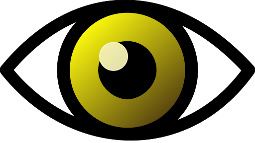
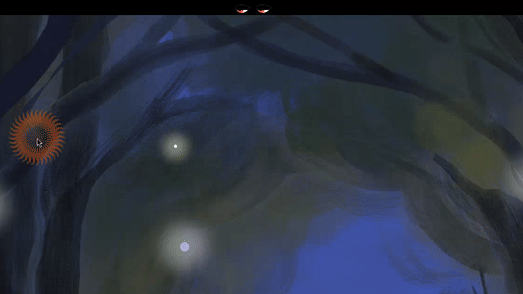
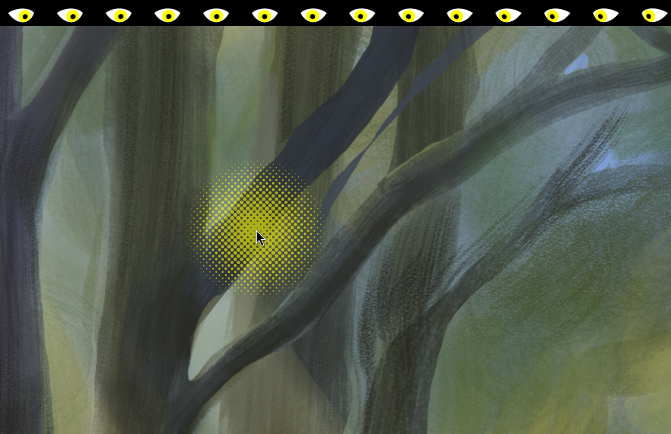
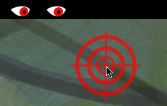
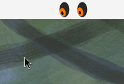
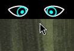
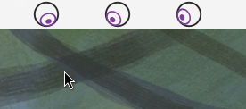

<h1 align="center">Eye on Cursor</h1>
<p align="center">
  <a href="https://github.com/djinnalexio/eye-on-cursor/blob/main/LICENSE">
    
  </a>
  <a href="https://github.com/djinnalexio/eye-on-cursor/releases/latest">
    
  </a>
</p>
<p align="center">
  <a href="https://extensions.gnome.org/extension/7036/eye-on-cursor/">
    
    
  </a>
</p>
<p align="center">
  
</p>
<h3 align="center">Let your desktop "keep an eye" on your mouse!</h3>

## Overview

**Eye on Cursor** is a fun and practical extension that gives your panel eyes that constantly follow
your mouse. This quirky feature, combined with a highly customizable mouse tracker that highlights
clicks, makes it easier than ever to monitor your mouse movements, ensuring your pointer gets all
the attention it needs.

<p align="center">

</p>
<p align="center">

</p>
<p align="center">


</p>
<p align="center">


</p>

## Features

- **Eyes Follow Cursor:** As many eyes as you want in the panel to follow the cursor movements,
  providing a fun and interactive experience.
- **Customizable Mouse Tracker:** Highlights clicks and tracks mouse movements with customizable
  settings to fit your preferences.

## Installation

### From the GNOME Extensions Website (recommended)

[](https://extensions.gnome.org/extension/7036/eye-on-cursor/)

### From GitHub

> ⚠️ **Note:** When installing this extension manually from GitHub, it will
> **not receive automatic updates** from the GNOME Extensions website.

1. Go to [the latest release](https://github.com/djinnalexio/eye-on-cursor/releases/latest) and
  download the extension zip file.

2. At the location of the downloaded zip file, run the install command:

    ```bash
    gnome-extensions install --force eye-on-cursor@djinnalexio.github.io.shell-extension.zip
    ```

3. Log out of your session and log back in, then enable the extension using your Extensions manager
  app or by running:

    ```bash
    gnome-extensions enable eye-on-cursor@djinnalexio.github.io
    ```

## Acknowledgements

This extension is forked from
[Eye and Mouse Extended](https://extensions.gnome.org/extension/3139/eye-extended/) by
[Alexey Lovchikov](https://github.com/alexeylovchikov).

**Eye and Mouse Extended** also has a fork for the Cinnamon Desktop,
[Cinnamon Eyes](https://cinnamon-spices.linuxmint.com/applets/view/363), created by
[anaximeno](https://github.com/anaximeno/).

## Contributing

First off, thanks for taking the time to contribute! ❤️

If you want to **ask a question**, **offer a suggestion**, or **report a bug**, feel free to open an
[issue](https://github.com/djinnalexio/eye-on-cursor/issues/new).

You can also submit pull requests to provide **translations**, **new tracker icons**, or
**bug fixes**.

If you have contributed in any way, feel free to add yourself to the `about.js` file in
`settings`.

### Known Issues

- On **Wayland**, the mouse tracker uses `globe.stage` to listen to clicks:
  - clicks within application windows are not registered. Only clicks in the Shell (background,
  panel, etc.) are highlighted.

- On **x11**, the mouse tracker uses `Atspi` listen to clicks:
  - middle click is not registered.

### Resources

- [GNOME Shell Extensions Guide](https://gjs.guide/extensions)
- [GNOME Developer Documentation](https://developer.gnome.org/documentation/index.html)
- [GNOME Shell Repository](https://gitlab.gnome.org/GNOME/gnome-shell#gnome-shell)
- [Poedit Translation Editor](https://flathub.org/apps/net.poedit.Poedit)
