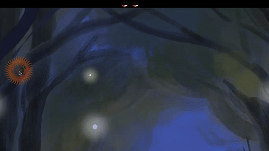
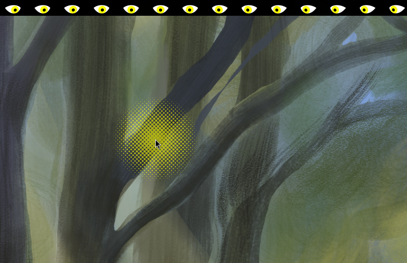
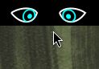
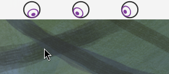

<h1 align="center">Eye on Cursor</h1>
<p align="center">
  <a href="https://github.com/djinnalexio/eye-on-cursor/blob/main/LICENSE">
    
  </a>
  <a href="https://github.com/djinnalexio/eye-on-cursor/releases/latest">
    
  </a>
</p>
<p align="center">
  <a href="https://extensions.gnome.org/extension/7036/eye-on-cursor/">
    
    
  </a>
</p>
<p align="center">
  
</p>
<h3 align="center">Let your desktop "keep an eye" on your mouse!</h3>

## Overview

**Eye on Cursor** is a fun and practical extension that gives your panel eyes that constantly follow your mouse. This quirky feature, combined with a highly customizable mouse tracker that highlights clicks, makes it easier than ever to monitor your mouse movements, ensuring your pointer gets all the attention it needs.

<p align="center">


</p>
<p align="center">


</p>
<p align="center">


</p>

## Features

- **Eyes Follow Cursor:** As many eyes as you want in the panel to follow the cursor movements, providing a fun and interactive experience.
- **Customizable Mouse Tracker:** Highlights clicks and tracks mouse movements with customizable settings to fit your preferences.
- **Click Highlighting:** Visual feedback for mouse clicks, making it easier to keep track of your actions, especially useful for presentations or demonstrations.

## Installation

### From the GNOME Extensions Website (recommended)

[](https://extensions.gnome.org/extension/7036/eye-on-cursor/)

### From GitHub

1. Go to [the latest release](https://github.com/djinnalexio/eye-on-cursor/releases/latest) and download the extension zip file.
2. At the location of the downloaded zip file, run:

   ```bash
   gnome-extensions install --force eye-on-cursor@djinnalexio.github.io.shell-extension.zip
   ```

3. Log out and back in, then enable the extension in your extensions app or with:

    ```bash
    gnome-extensions enable eye-on-cursor@djinnalexio.github.io
    ```

## Acknowledgements

This extension is forked from [Eye and Mouse Extended](https://extensions.gnome.org/extension/3139/eye-extended/) by [Alexey Lovchikov](https://github.com/alexeylovchikov).

**Eye and Mouse Extended** also has a fork for the Cinnamon Desktop, [c-eyes](https://github.com/anaximeno/c-eyes), created by [anaximeno](https://github.com/anaximeno/).

## Contributing

Contributions are welcome! Please feel free to submit a pull request or open an issue if you have any suggestions or find any bugs.

Translations and new glyphs for the mouse tracker are greatly appreciated as well!

If you have contributed in any way, feel free to add yourself to the `credits.js` file in `settings`.

### Development

In the root of the repo, run `make install && make enable` to use the extension or `make test` to debug it. The `Makefile` contains a few other commands that should be useful for debugging.

### Known Issues

- On Wayland, the mouse tracker click highlighting feature does not function within application windows.

  Wayland handles events differently compared to X11, isolating them to the window where they occur. On x11, **Eye on Cursor** uses `Atspi` to listen to mouse clicks, which doesn't work at all on Wayland. On Wayland, the extension thus resorts to listening with `globe.stage` instead, with its caveat that only clicks in the Shell (background, panel, etc.) are registered.

- On x11, middle click is not registered.

  `Atspi` does not register middle clicks.

### Documentation on Developing GNOME Extensions

Resources to get you started:

- [Extensions Guide](https://gjs.guide/extensions)
- [GNOME Shell Extensions Review Guidelines](https://gjs.guide/extensions/review-guidelines/review-guidelines.html)
- [GNOME GJS Code Conventions](https://gjs.guide/guides/gjs/style-guide.html#code-conventions)
- [GNOME Human Interface Guidelines](https://developer.gnome.org/hig/)
- [GJS Documentation](https://gitlab.gnome.org/GNOME/gjs/-/tree/HEAD/doc#gjs)
- [GJS API Documentation](https://gjs-docs.gnome.org/)
- [ADW Widgets Documentation](https://gnome.pages.gitlab.gnome.org/libadwaita/doc/1-latest/widget-gallery.html)
- [GTK Widgets Documentation](https://docs.gtk.org/gtk4/visual_index.html)
- [GNOME Shell Source Code](https://gitlab.gnome.org/GNOME/gnome-shell#gnome-shell)
- [Poedit](https://flathub.org/apps/net.poedit.Poedit)
